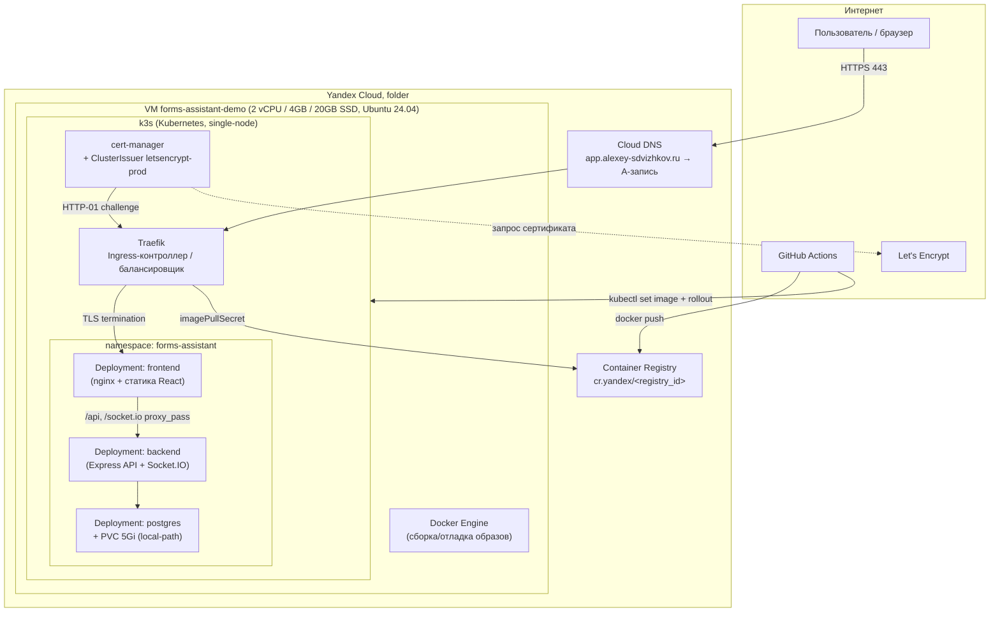
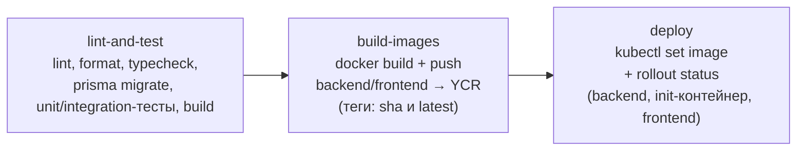

# Инфраструктура Forms Assistant

Подробное описание демо-стенда: облако, сеть, кластер, контейнеры, балансировщик, TLS, CI/CD.
Стенд поднят полностью через Terraform + Kubernetes-манифесты, воспроизводим с нуля.
Код инфраструктуры — в [`infra/`](./infra). Живая копия: **https://app.alexey-sdvizhkov.ru**.

## 1. Общая картина



## 2. Облако: Yandex Cloud

Всё управляется Terraform (`infra/terraform/`) через провайдер `yandex-cloud/yandex`, авторизация — по ключу сервисного аккаунта (не логин/пароль, не OAuth-токен пользователя).

### 2.1 Сервисные аккаунты и разделение прав

На демо-стенде сознательно два сервисных аккаунта, а не один — это отдельно демонстрирует принцип наименьших привилегий:

| Сервисный аккаунт           | Роли                                                                             | Кто использует                                                                                                                                       |
| --------------------------- | -------------------------------------------------------------------------------- | ---------------------------------------------------------------------------------------------------------------------------------------------------- |
| `forms-assistant-terraform` | `editor` + `admin` на каталоге                                                   | Terraform — создаёт/меняет все ресурсы, включая выдачу IAM-ролей другим сервисным аккаунтам (для этого нужен именно `admin`, `editor` этого не даёт) |
| `forms-assistant-demo-ci`   | `container-registry.images.pusher` + `container-registry.images.puller` (только) | GitHub Actions (push образов) и Kubernetes (`imagePullSecret`, pull образов) — не может ничего больше в облаке                                       |

### 2.2 Виртуальная машина

- Имя: `forms-assistant-demo`, зона `ru-central1-b`, платформа `standard-v3`.
- Ресурсы: 2 vCPU (`core_fraction=100`, т.е. без троттлинга), 4 GB RAM, 20 GB `network-ssd`.
- ОС: Ubuntu 24.04 LTS, доступ по SSH-ключу (пользователь с `sudo NOPASSWD`), задан через `cloud-init` при создании.
- Публичный IP статический (`yandex_vpc_address`) — отдельный ресурс, не эфемерный, чтобы IP не менялся при пересоздании VM.

### 2.3 Сеть и security group

Подсеть уже существовала в консоли (создана заранее вручную) — Terraform её не создаёт, а только читает через `data "yandex_vpc_subnet"`, чтобы получить `network_id` для security group.

Security group (`yandex_vpc_security_group`) открывает только 4 порта на вход:

| Порт | Протокол | Зачем                                                                             |
| ---- | -------- | --------------------------------------------------------------------------------- |
| 22   | TCP      | SSH-администрирование                                                             |
| 80   | TCP      | HTTP — нужен для ACME HTTP-01 challenge (Let's Encrypt) и как fallback            |
| 443  | TCP      | HTTPS — весь пользовательский трафик                                              |
| 6443 | TCP      | Kubernetes API (k3s) — чтобы `kubectl` и CI могли достучаться до кластера снаружи |

Egress не ограничен. Правила сейчас открыты на `0.0.0.0/0` — приемлемо для 3-дневного демо-стенда; в проде это первое, что стоит сузить (например, до IP CI-раннеров и офиса).

### 2.4 DNS

Домен `alexey-sdvizhkov.ru` куплен отдельно на reg.ru. DNS-зона создана в **Yandex Cloud DNS** (`yandex_dns_zone`), там же — A-запись `app.alexey-sdvizhkov.ru → <статический IP>` (`yandex_dns_recordset`). У регистратора (reg.ru) домену назначены NS-серверы Yandex Cloud DNS (`ns1.yandexcloud.net`, `ns2.yandexcloud.net`) — то есть регистратор только владеет доменом, а фактическое управление записями полностью на стороне Yandex Cloud и тоже описано кодом.

### 2.5 Container Registry

`yandex_container_registry` — приватный Docker-реестр. Два образа: `backend` и `frontend`, у каждого при сборке два тега — `latest` и хэш коммита (`github.sha`) для однозначного соответствия версии в кластере конкретному коммиту.

## 3. Kubernetes: k3s

Выбран **k3s** (лёгкий дистрибутив Kubernetes от Rancher), а не Yandex Managed Kubernetes — сознательное решение под ограничения демо (одна VM, 3 дня): managed-кластер — это отдельный платный многонодовый ресурс, избыточный по деньгам и по времени настройки для этой задачи. При этом k3s — полноценный Kubernetes: тот же `kubectl`, те же манифесты, Deployment/Service/Ingress/Secret работают без каких-либо адаптаций.

Кластер single-node: одна и та же VM одновременно control-plane и единственный worker.

### 3.1 Что идёт «из коробки» с k3s

- **Traefik** — Ingress-контроллер (он же балансировщик, см. раздел 4).
- **CoreDNS** — внутренний DNS кластера (резолвинг `backend.forms-assistant.svc.cluster.local` и коротких имён вроде `backend` внутри namespace).
- **local-path-provisioner** — динамическое создание PersistentVolume прямо на диске ноды (storage class `local-path`), используется для диска Postgres.
- **metrics-server** — даёт `kubectl top nodes/pods` (полезно для демонстрации использования ресурсов на лимите 4 GB).
- **servicelb (klipper-lb)** — эмулирует `Service type=LoadBalancer` на одной ноде через iptables/NAT, пробрасывая внешний трафик с портов 80/443 хоста в ClusterIP Traefik.

### 3.2 Namespace `forms-assistant`

Всё приложение живёт в отдельном namespace (не в `default`) — стандартная практика изоляции.

| Ресурс                                | Тип                              | Назначение                                                                                                                                                                                                |
| ------------------------------------- | -------------------------------- | --------------------------------------------------------------------------------------------------------------------------------------------------------------------------------------------------------- |
| `postgres`                            | Deployment (1 реплика) + PVC 5Gi | База данных. `strategy: Recreate` (не RollingUpdate — с одним диском RWO два пода одновременно писать не могут).                                                                                          |
| `backend`                             | Deployment (1 реплика)           | Express API + Socket.IO. Перед стартом контейнера — **init-контейнер**, выполняющий `npx prisma migrate deploy` на том же образе: миграции БД накатываются автоматически при каждом деплое, идемпотентно. |
| `frontend`                            | Deployment (1 реплика)           | nginx: отдаёт собранный React как статику, проксирует `/api/*` и `/socket.io/*` на `backend:4000`.                                                                                                        |
| `postgres-secrets`, `backend-secrets` | Secret                           | Пароль БД, JWT-секреты, секрет анонимных токенов — генерируются случайно (`openssl rand`) скриптом `infra/scripts/create-k8s-secrets.sh`, не хранятся в git.                                              |
| `ycr-pull-secret`                     | Secret (`dockerconfigjson`)      | Позволяет kubelet тянуть приватные образы из Container Registry по ключу узкого CI-сервис-аккаунта.                                                                                                       |
| `backend-config`                      | ConfigMap                        | Несекретные переменные (`NODE_ENV`, TTL токенов, `CORS_ORIGIN`).                                                                                                                                          |

Все три компонента общаются друг с другом по внутренним `Service` (ClusterIP) — `postgres:5432`, `backend:4000` — снаружи кластера эти адреса не существуют, наружу торчит только Ingress.

## 4. Балансировщик / Ingress: Traefik

Traefik — единственная точка входа снаружи. Путь пакета:

```
Интернет → статический IP VM → klipper-lb (iptables DNAT) → Traefik (Service LoadBalancer)
    → Ingress-правила (по Host-заголовку) → Service → под
```

Ingress-ресурс (`infra/k8s/06-ingress.yaml`) описывает:

- host `app.alexey-sdvizhkov.ru`;
- TLS-терминацию (сертификат из secret `app-tls`, см. раздел 5);
- маршрут `/` → `Service frontend:80`.

Внутри frontend-контейнера уже nginx сам разруливает `/api` и `/socket.io` на backend — то есть в кластере два уровня проксирования: Traefik (по домену/TLS) → nginx (по пути внутри приложения). Это ровно та же схема, что и в docker-compose-варианте деплоя, поэтому `docker/nginx/frontend.conf` переиспользуется как есть, без дублирования логики.

## 5. TLS: cert-manager + Let's Encrypt

`cert-manager` следит за Ingress-ресурсами с аннотацией `cert-manager.io/cluster-issuer` и сам заказывает/обновляет сертификаты.

Заведено два `ClusterIssuer` (`infra/k8s/00-cluster-issuer.yaml`):

- **`letsencrypt-staging`** — тестовый сервер Let's Encrypt. Сертификаты подписаны недоверенным тестовым корнем (браузеры и антивирусы их не примут), зато лимиты на запросы почти не ограничены — используется, чтобы отладить прохождение challenge, не спалив лимиты боевого сервера.
- **`letsencrypt-prod`** — боевой, реально доверенный браузерами. Используется сейчас, после того как staging подтвердил, что challenge проходит.

Схема выпуска — **HTTP-01**:

1. cert-manager создаёт временный под + Ingress-правило на путь `/.well-known/acme-challenge/<token>`.
2. Let's Encrypt (и сам cert-manager, self-check) обращается по HTTP на `app.alexey-sdvizhkov.ru` — если ответ верный, домен считается подтверждённым.
3. Сертификат кладётся в Secret `app-tls`, который Traefik сразу подхватывает для TLS-терминации.
4. Автопродление — cert-manager сам переоформит сертификат заранее до истечения (Let's Encrypt выдаёт на 90 дней).

Важное следствие: HTTP-01 требует, чтобы домен **резолвился и порт 80 был доступен снаружи** — то есть без прописанного DNS и открытой SG-записи на 80 сертификат в принципе не выпустится.

## 6. Docker-образы

Оба образа собираются multi-stage (`apps/backend/Dockerfile`, `apps/frontend/Dockerfile`), общий паттерн:

1. **deps** — ставятся npm-зависимости всего workspace (нужно, т.к. `packages/shared` — общий пакет без сборки, резолвится напрямую).
2. **build** — компиляция (`tsup` для backend, `vite build` для frontend), для backend дополнительно `prisma generate`.
3. **runtime** — минимальный финальный слой: для backend — `node:20-alpine` + собранный `dist` + `node_modules` + Prisma-схема/миграции; для frontend — `nginx:1.27-alpine` + собранная статика + `frontend.conf`.

Это даёт компактные рантайм-образы (без исходников, dev-тулинга, лишних слоёв) при полном воспроизведении той же сборки, что использовалась бы локально.

## 7. CI/CD: GitHub Actions

Файл `.github/workflows/ci.yml`, триггер — push в `master`. Три последовательных job:



- **lint-and-test** — поднимает Postgres как сервис-контейнер GitHub Actions, гоняет полный набор проверок и интеграционных тестов (включая тесты анонимности и прав доступа к чату) на реальной БД.
- **build-images** — логинится в `cr.yandex` ключом узкого CI-сервис-аккаунта, собирает оба образа, пушит с двумя тегами.
- **deploy** — поднимает `KUBE_CONFIG` из GitHub Secret во временный kubeconfig, обновляет image-теги в уже существующих Deployment'ах (`kubectl set image`, включая init-контейнер `migrate` у backend — миграции накатятся автоматически) и ждёт успешного rollout (таймаут 180с, если что-то не поднимется — job упадёт красным).

Все три job идут строго последовательно (`needs:`) — деплой не начнётся, пока не собраны и не запушены свежие образы, а сборка не начнётся, пока не прошли все проверки.

### 7.1 Секреты в GitHub

| Secret               | Содержимое                          | Зачем                                         |
| -------------------- | ----------------------------------- | --------------------------------------------- |
| `YC_REGISTRY_SA_KEY` | JSON-ключ `forms-assistant-demo-ci` | `docker login cr.yandex` в job `build-images` |
| `KUBE_CONFIG`        | kubeconfig k3s-кластера             | Доступ `kubectl` в job `deploy`               |

Оба секрета доступны только внутри Actions-раннеров, не видны в логах, не пробрасываются в PR из форков (`pull_request` без `pull_request_target`).

## 8. Что произойдёт, если сервер пересоздать

Стенд полностью воспроизводим:

1. `terraform apply` — поднимет VM/сеть/DNS/registry заново (на новом статическом IP, если старый не удерживался).
2. `infra/scripts/bootstrap-server.sh` — поставит Docker и k3s.
3. `infra/scripts/create-k8s-secrets.sh` — создаст секреты (сгенерирует новые случайные, т.к. это новый Postgres).
4. `kubectl apply -f infra/k8s/` — накатит все манифесты приложения.
5. Ручной `docker build && docker push` (или просто новый push в `master`) — зальёт актуальные образы, CI сам их задеплоит.

Единственное, что не автоматизировано полностью — обновление A-записи, если IP изменился (в Terraform она уже привязана к ресурсу `yandex_vpc_address`, поэтому это тоже подхватится автоматически при `apply`, если IP пересоздаётся вместе с ним).

## 9. Осознанные ограничения демо-стенда

Сделано сознательно проще, чем было бы в проде — под задачу «показать инфраструктуру за 3 дня», а не «выдержать нагрузку»:

- **Single-node** — нет отказоустойчивости ни на уровне VM, ни на уровне Kubernetes control-plane.
- **1 реплика** на каждый компонент — без `HorizontalPodAutoscaler`, без rolling-стратегии с несколькими подами одновременно (кроме backend/frontend, которые технически позволяют масштабирование, но не настроено).
- **SG открыт на `0.0.0.0/0`** для 22/6443 — для реального прода стоит сузить.
- **Postgres без бэкапов** — только PVC на локальном диске ноды, при потере диска — потеря данных.
- **Нет observability-стека** (Prometheus/Grafana/Loki) — есть только встроенный `metrics-server`.
