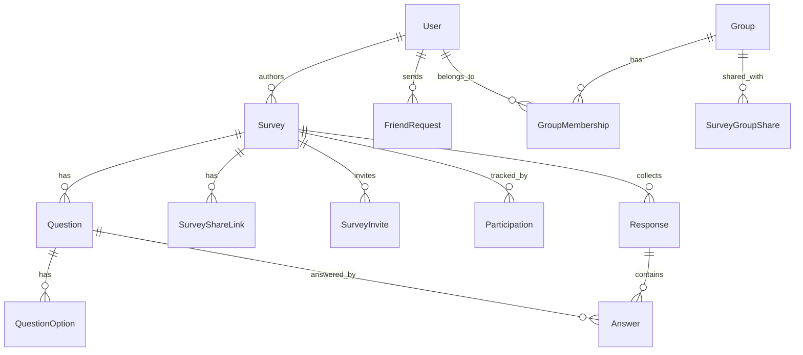

# PLAN.md — Forms Assistant

Платформа для создания и прохождения опросов с друзьями/группами и тремя режимами анонимности.

## Зафиксированные решения (Этап 0)

- **Auth**: email + пароль, JWT (access + refresh), без верификации email на MVP.
- **Роли**: без разделения — любой залогиненный пользователь может создавать опросы.
- **Группы**: иерархия — у группы есть владелец/админ(ы), которые управляют составом.
- **Друзья**: заявка → подтверждение (двусторонняя связь).
- **Вопросы**: `SINGLE_CHOICE`, `MULTIPLE_CHOICE`, `TEXT`; флаг `required`. Без шкал/лимитов длины на MVP.
- **Повторное прохождение**: настраивается автором опроса (`allowMultipleSubmissions`).
- **Лимиты (дедлайн/участники)**: нет на MVP.
- **Анонимность**: 3 режима — `ANONYMOUS`, `PUBLIC_LIST`, `NAMED` (см. модель БД ниже).
- **Аналитика**: базовая агрегация (счётчики/проценты по choice-вопросам, список текстовых ответов). CSV/графики — не на MVP, но схема не должна мешать добавить их позже.
- **Уведомления**: нет на MVP.
- **Деплой**: VPS + docker-compose (домен/DNS/nginx настраиваются позже, когда появится сервер).

## Архитектура

Монорепозиторий (npm workspaces):

```
forms-assistant/
├── apps/
│   ├── backend/     # Express + TS + Prisma + PostgreSQL
│   └── frontend/    # React + Vite + TS + Zustand
├── packages/
│   └── shared/      # общие типы, zod-схемы, DTO контракты
├── docker/
├── .github/workflows/
└── PLAN.md
```

### Модель данных (mermaid ER, верхнеуровнево)



**Ключевой момент модели анонимности:**

- `Response` имеет `submissionToken` (не связан с пользователем) и `respondentUserId` (nullable).
  `respondentUserId` заполняется **только** для `NAMED` опросов. Для `ANONYMOUS`/`PUBLIC_LIST` он всегда `NULL` — на уровне схемы (не просто логики).
- `Participation` (кто прошёл опрос) — отдельная таблица `(surveyId, userId, completedAt)`, создаётся только для `PUBLIC_LIST` и `NAMED`. У неё **нет** внешнего ключа на `Response`/`Answer` — по конкретной записи `Participation` нельзя найти ответы этого пользователя.
- Для `ANONYMOUS` защита от повторного прохождения (если `allowMultipleSubmissions=false`) — через анонимный HMAC-токен в cookie, проверяемый в `AnonymousSubmissionGuard (surveyId, tokenHash)`, без привязки к личности.

### API — верхнеуровнево

- `POST /auth/register`, `/auth/login`, `/auth/refresh`, `/auth/logout`
- `GET/PATCH /users/me`, `GET /users/:id`
- `POST /friends/requests`, `PATCH /friends/requests/:id`, `GET /friends`
- `POST /groups`, `PATCH /groups/:id`, `POST /groups/:id/members`, `DELETE /groups/:id/members/:userId`
- `POST /surveys`, `GET /surveys/mine`, `GET /surveys/:id`, `PATCH /surveys/:id`, `DELETE /surveys/:id`
- `POST /surveys/:id/publish`, `POST /surveys/:id/share-link`, `POST /surveys/:id/invite`, `POST /surveys/:id/share-group`
- `GET /s/:token` (публичный доступ по ссылке), `POST /surveys/:id/responses`
- `GET /surveys/:id/results` (агрегация), `GET /surveys/:id/participants`

## Эпики

### Эпик 1 — Инфраструктура и окружение монорепо

- [x] npm workspaces, корневой package.json, tsconfig base (переключились с pnpm на npm из-за нестабильной сети при установке крупных пакетов Prisma)
- [x] ESLint + Prettier конфиги (shared)
- [x] Husky + lint-staged
- [x] Структура apps/backend, apps/frontend, packages/shared

### Эпик 2 — Схема БД и Prisma

- [x] Prisma schema (User, Survey, Question, QuestionOption, Response, Answer, Participation, FriendRequest, Group, GroupMembership, SurveyShareLink, SurveyInvite, SurveyGroupShare, AnonymousSubmissionGuard)
- [x] Миграции + seed-скрипт

### Эпик 3 — Backend: каркас, ошибки, auth

- [x] Express app, слоистая архитектура (routes/controllers/services/repositories)
- [x] Zod DTO-валидация на входе, error middleware, логирование
- [x] Регистрация/логин, JWT access+refresh, middleware auth

### Эпик 4 — Backend: friends/groups

- [x] Заявки в друзья (создание/подтверждение/отклонение), список друзей
- [x] CRUD групп, управление участниками/админами

### Эпик 5 — Backend: survey CRUD + вопросы

- [x] CRUD опроса и вопросов/вариантов, publish/close
- [x] Шеринг: invite конкретных пользователей, share-link, share с группой

### Эпик 6 — Backend: прохождение опроса и результаты

- [x] Публичный доступ к опросу по токену/id, отправка ответов (с учётом 3 режимов анонимности)
- [x] Защита от повторного прохождения (именной/публичный через Participation, анонимный через guard-токен)
- [x] Агрегация результатов, список участников (без ответов, если не именной)
- [x] Проверено вручную end-to-end на локальном Postgres (register → create → publish → take → submit → results/participants → повторная отправка отклонена)

### Эпик 7 — Frontend: каркас

- [x] Vite + React + TS + Router, FSD структура, Zustand-сторы (auth/surveys/ui), fetch-клиент с типами из packages/shared (проверено в браузере: рендер, редирект защищённых роутов, консоль чистая)

### Эпик 8 — Frontend: аутентификация и профиль

- [x] Регистрация/логин формы (react-hook-form + zod), защищённые роуты
- [x] Профиль: мои опросы / где я участник / друзья / группы (добавлен backend-эндпоинт GET /surveys/shared-with-me)
- [x] Проверено в браузере: регистрация → сессия → профиль → поиск и заявка в друзья → создание группы, всё подтверждено через API

### Эпик 9 — Frontend: создание/редактирование опроса

- [x] Конструктор опроса (react-hook-form + useFieldArray, вопросы/варианты, required, тип анонимности, allowMultipleSubmissions); после публикации вопросы и режим анонимности блокируются на UI и на backend (тихо игнорируются, а не ошибка)
- [x] Управление шерингом (ссылка, приглашение пользователей, шеринг с группой) — виджет SurveyManagementPanel
- [x] Проверено в браузере end-to-end: создание черновика → публикация → генерация ссылки → блокировка редактирования вопросов, всё подтверждено через API и прямой JS-клик (расширение браузера конфликтовало с Kaspersky на синтетических кликах — сама логика приложения корректна)

### Эпик 10 — Frontend: прохождение опроса и результаты

- [x] Страница прохождения (публичная по ссылке `/s/:token` + для приглашённых по `/surveys/:id/take`), поддержка required/single/multiple/text, состояния "уже пройдено"/"нужен вход"
- [x] Страница результатов (агрегация с процентами и список участников)
- [x] Проверено в браузере end-to-end: прохождение опроса по ссылке → отправка ответа → страница результатов показывает верную агрегацию (1 ответ, 100%/0%) и участника с датой прохождения; подтверждено и через API

### Эпик 11 — Docker

- [x] Dockerfile backend/frontend (multi-stage), docker-compose.yml (dev, с postgres), docker-compose.prod.yml
- [x] Проверено: `docker compose up -d --build` поднимает все 3 сервиса, миграции применяются, health-check и регистрация пользователя работают через контейнеры, nginx корректно проксирует `/api` на backend
- [x] Найдены и исправлены реальные баги при сборке образов (не флуктуации сети):
  - оба Dockerfile не копировали корневой `tsconfig.base.json`, от которого наследуются `apps/*/tsconfig.json` — `tsc`/`vite` не могли его найти в чистом контейнере (локально маскировалось инкрементальным кэшем `tsc -b`)
  - `tsup` по умолчанию не бандлит workspace-зависимости — рантайм-образ backend падал с `ERR_MODULE_NOT_FOUND: @forms-assistant/shared`, т.к. в финальный образ копируется только `dist`, без `packages/shared`. Исправлено через `apps/backend/tsup.config.ts` с `noExternal: ['@forms-assistant/shared']`, чтобы shared-код инлайнился в бандл

### Эпик 12 — CI/CD

- [x] GitHub Actions workflow (.github/workflows/ci.yml): install → lint → format:check → typecheck → prisma generate/deploy → test → build, отдельный job сборки Docker-образов с кэшем через `type=gha`
- [x] Workflow выровнен со всеми фактическими изменениями сессии (npm вместо pnpm, актуальные секреты для тестов)
- [x] Репозиторий запушен на GitHub (`git@github.com:Alexey-UI/froms-assistant.git`) — workflow готов к первому реальному прогону на push

### Эпик 13 — Тесты

- [x] packages/shared: тесты zod-схем (`questionInputSchema` — правила superRefine для choice/text вопросов, `createSurveySchema`, `answerInputSchema`/`submitResponseSchema`)
- [x] backend: `lib/duration.ts` (парсинг TTL)
- [x] backend: интеграционные тесты гарантий анонимности через supertest + реальный Postgres (`modules/responses/anonymity.integration.test.ts`) — ключевой тест для этого проекта:
  - ANONYMOUS: `Response.respondentUserId` всегда `null`, `Participation` не создаётся
  - PUBLIC_LIST: `Participation` создаётся, но `Response.respondentUserId` всё равно `null`
  - NAMED: `Response.respondentUserId` корректно указывает на respondent
  - неаутентифицированная отправка в NAMED-опрос отклоняется (401)
- [ ] Точечно можно расширить (friends/groups edge cases), но основной риск (анонимность) покрыт

## Групповой чат (согласовано с пользователем 2026-07-31)

Зафиксированные решения:

- Запрет писать — отдельный флаг `canWrite` на `GroupMembership`, независим от роли ADMIN/MEMBER (mute, не кик). Виден всем участникам группы.
- Доступ к истории — только пока состоишь в группе.
- Автор может удалить своё сообщение, админ — любое; редактирование текста после отправки разрешено.
- Контент — только текст на MVP.
- Нужен бейдж непрочитанных (в списке групп в профиле).
- Админ может добавлять/удалять участников и менять роли прямо со страницы группы (backend для add/remove/role уже существовал, не хватало фронтенда).
- Транспорт: REST — источник истины и единственный путь мутаций (как и весь проект); Socket.IO — только push-уведомления поверх REST (комнаты `group:<id>` и `user:<id>`), без брокера pub/sub — один процесс backend, in-memory adapter Socket.IO достаточен.

### Эпик 14 — Backend: модель чата

- [ ] Prisma: модель `GroupMessage` (groupId, authorId, text, editedAt?, createdAt), поля `canWrite`/`lastReadAt` на `GroupMembership`
- [ ] Миграция

### Эпик 15 — Backend: REST для сообщений

- [ ] `GET /groups/:id/messages` (курсорная пагинация), `POST /groups/:id/messages`
- [ ] `PATCH /groups/:id/messages/:messageId` (автор), `DELETE /groups/:id/messages/:messageId` (автор или админ)
- [ ] `POST /groups/:id/read`, `GET /groups/unread-summary`
- [ ] Проверка `canWrite` при отправке, проверка членства в группе на все операции

### Эпик 16 — Backend: управление участниками (админ)

- [ ] `PATCH /groups/:id/members/:userId/mute` (только админ)
- [ ] Фронтенд для уже существующих add/remove/role эндпоинтов (сами эндпоинты готовы с Эпика 4)

### Эпик 17 — Backend: realtime-слой (Socket.IO)

- [ ] `http.Server` вместо `app.listen`, Socket.IO поверх него, JWT-аутентификация handshake
- [ ] Auto-join в комнаты `group:<id>` для своих групп + личная комната `user:<id>`
- [ ] Рассылка событий из сервисов после мутаций (новое/изменённое/удалённое сообщение, mute, участники, непрочитанные)

### Эпик 18 — Frontend: клиент чата и стор

- [ ] `socket.io-client`, подключение на уровне App (аналогично `initAuth`), обработка reconnect/logout
- [ ] Zustand-стор: сообщения по группам, статус соединения, непрочитанные

### Эпик 19 — Frontend: страница группы `/groups/:groupId`

- [ ] Кликабельное название группы в профиле → переход на страницу
- [ ] Лента сообщений с подгрузкой истории, инпут (disabled + пояснение при mute), редактирование/удаление своих сообщений
- [ ] Список участников с ролями и mute-бейджем (видно всем)

### Эпик 20 — Frontend: админ-панель группы

- [ ] Пригласить участника (поиск по друзьям, аналогично инвайту в опрос), удалить участника
- [ ] Сменить роль ADMIN/MEMBER, замьютить/размьютить — удаление чужих сообщений

### Эпик 21 — Frontend: бейдж непрочитанных

- [ ] В списке групп в профиле, обновление в реальном времени через личную комнату сокета

### Эпик 22 — Тесты чата

- [ ] Интеграционный тест прав доступа: не-участник не может читать/писать, замьюченный не может писать, удалять чужие сообщения может только автор/админ

---

_План — рабочий документ, обновляется по ходу работы. Технические развилки (структура папок, конкретные библиотеки внутри стека) решаются автономно и фиксируются здесь при значимости._
